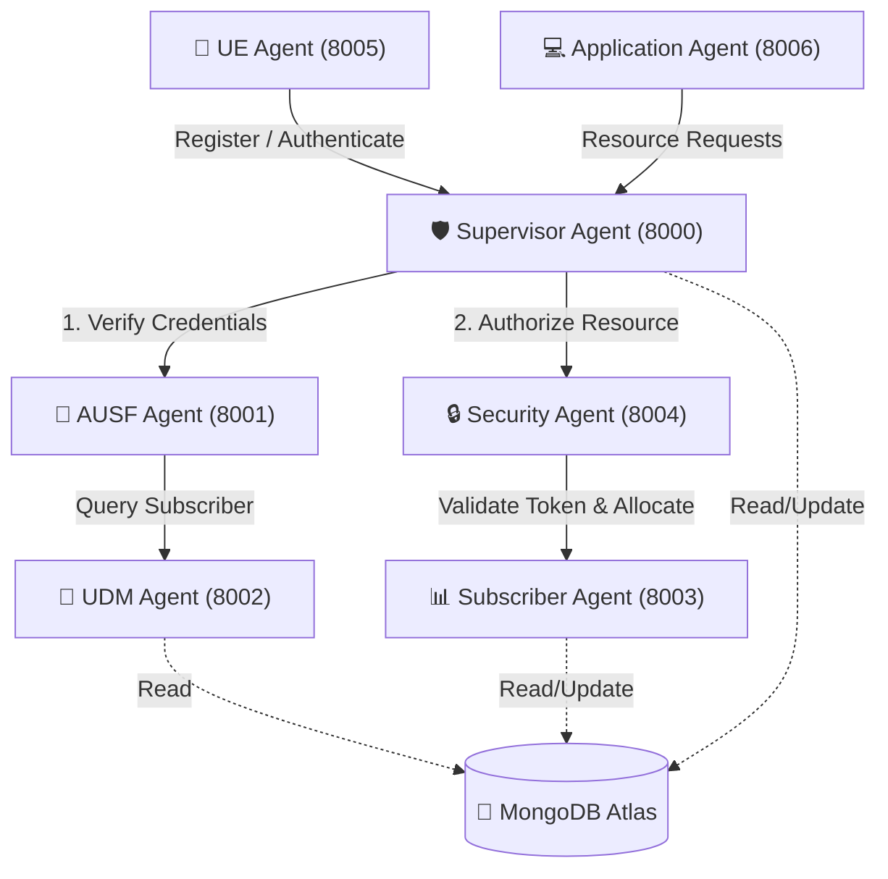

# 📡 Nokia 6G / 5G AI Multi-Agent Network Architecture

An intelligent, microservice-based multi-agent network orchestration and slice authorization system built with **FastAPI**, **MongoDB Atlas**, and **PyJWT**. The system simulates key 5G/6G Core Network functions (AUSF, UDM, Security, Subscriber Management) operating as autonomous, interacting micro-agents.

---

## 🏗️ System Architecture



---

## 🤖 Multi-Agent Port & Service Reference

| Agent Name | Port | Description / Primary Role | Key Endpoints |
| :--- | :---: | :--- | :--- |
| **Supervisor Agent** | `8000` | Central orchestrator & gateway for UE registration, authentication routing, and security validation. | `POST /register`<br>`POST /authenticate`<br>`POST /authorize-resource`<br>`GET /status` |
| **AUSF Agent** | `8001` | Authentication Server Function (AUSF). Validates subscriber secret key with UDM and issues signed JWT tokens. | `POST /authenticate` |
| **UDM Agent** | `8002` | Unified Data Management (UDM). Interfaces with MongoDB to fetch subscriber profiles. | `POST /subscriber` |
| **Subscriber Agent** | `8003` | Manages subscriber dynamic bandwidth, slice allocations, trust score evaluation, and plan details. | `POST /allocate-bandwidth`<br>`GET /subscriber/{device_id}` |
| **Security Agent** | `8004` | Decodes & verifies JWT signatures and enforces resource access authorization policies. | `POST /authorize` |
| **UE Agent** | `8005` | User Equipment simulator handling local device authentication state, JWT storage, and registration flows. | `POST /register`<br>`POST /authenticate`<br>`GET /status`<br>`POST /logout` |
| **Application Agent** | `8006` | Simulates high-demand 5G/6G applications requesting dynamic network bandwidth slices. | `POST /request-bandwidth` |

---

## 💾 Database Schema

The project uses MongoDB Atlas with three main collections:

1. **`UE`**: Stores registered user equipment devices (`device_id`, `imsi`, `imei`, `status`, `authenticated`).
2. **`Subscribers`**: Contains subscription plan, trust scores (`trust_score`), available/allocated bandwidth (`available_bandwidth`, `allocated_bandwidth`), and authentication keys (`secret_key`).
3. **`Sessions`**: Tracks active authenticated sessions with JWT tokens and login timestamps.

---

## 🛠️ Prerequisites & Installation

### 1. Requirements
* Python 3.8+
* MongoDB Atlas Cluster (or local MongoDB instance)

### 2. Install Dependencies
```bash
pip install -r requirements.txt
```

### 3. Environment Configuration (`.env`)
Create a `.env` file in the root directory with the following variables:
```env
MONGO_URI=mongodb+srv://<username>:<password>@cluster.mongodb.net/
DATABASE_NAME=5g_ai_agents
JWT_SECRET=your_super_secret_jwt_key
JWT_ALGORITHM=HS256
JWT_EXPIRY_MINUTES=30
```

### 4. Seed the Database
Populate MongoDB with initial test subscribers and UE device records:
```bash
python database/seed_database.py
```

---

## 🚀 Running the Multi-Agent System

Each agent runs as an independent FastAPI microservice on its dedicated port.

Start each service in a separate terminal:

```bash
# Terminal 1: Supervisor Agent (Gateway)
python agents/supervisor.py

# Terminal 2: AUSF Agent
python agents/ausf_agent.py

# Terminal 3: UDM Agent
python agents/udm_agent.py

# Terminal 4: Subscriber Agent
python agents/subscriber_agent.py

# Terminal 5: Security Agent
python agents/security_agent.py

# Terminal 6: UE Agent (Client Simulator)
python agents/ue_agent.py

# Terminal 7: Application Agent (App Simulator)
python agents/application_agent.py
```

---

## 🧪 Workflow & API Usage Example

### 1. Register User Equipment (UE)
```http
POST http://127.0.0.1:8005/register
Content-Type: application/json

{
  "device_id": "UE-001",
  "imsi": "404450123456789",
  "imei": "356938035643809"
}
```

### 2. Authenticate & Obtain JWT
```http
POST http://127.0.0.1:8005/authenticate
Content-Type: application/json

{
  "device_id": "UE-001",
  "secret_key": "ABC123XYZ"
}
```
*Returns a signed JWT token valid for 30 minutes.*

### 3. Request Bandwidth Slice
```http
POST http://127.0.0.1:8006/request-bandwidth
Content-Type: application/json

{
  "jwt_token": "<YOUR_JWT_TOKEN>"
}
```
*Validates token via Security Agent, checks subscriber trust score (>= 80), and allocates network slice bandwidth.*

### 4. Check Network Status
```http
GET http://127.0.0.1:8000/status
```

---

## 📁 Repository Structure

```
Nokia6G/
├── agents/
│   ├── application_agent.py   # Application-layer slice request simulator (Port 8006)
│   ├── ausf_agent.py          # Authentication Server Function agent (Port 8001)
│   ├── security_agent.py      # Security & JWT verification agent (Port 8004)
│   ├── subscriber_agent.py    # Slice bandwidth & subscriber agent (Port 8003)
│   ├── supervisor.py          # Central Gateway / Orchestrator agent (Port 8000)
│   ├── udm_agent.py           # Unified Data Management agent (Port 8002)
│   └── ue_agent.py            # User Equipment simulator agent (Port 8005)
├── database/
│   ├── mongo.py               # MongoDB PyMongo connection client setup
│   ├── seed_database.py       # Seed script for initial sample data
│   └── test_db.py             # Database ping connection test
├── .env                       # Environment configuration file
├── requirements.txt           # Python package dependencies
├── overview.txt               # Port layout mapping summary
└── README.md                  # Project documentation
```
